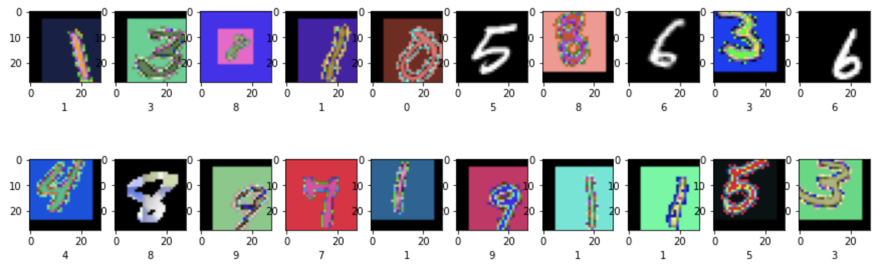
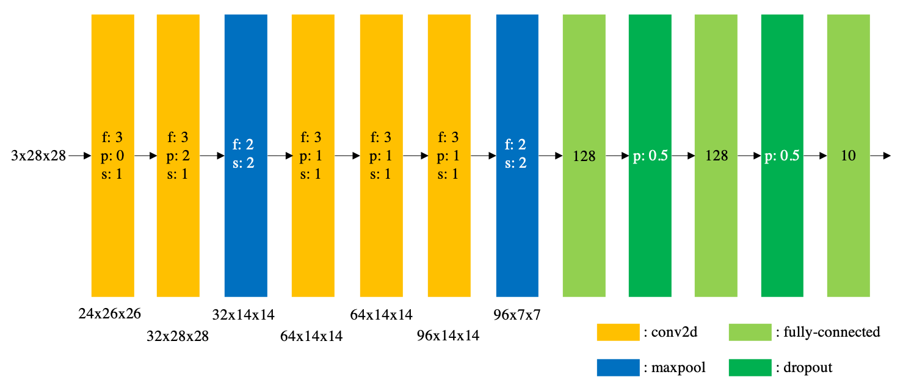
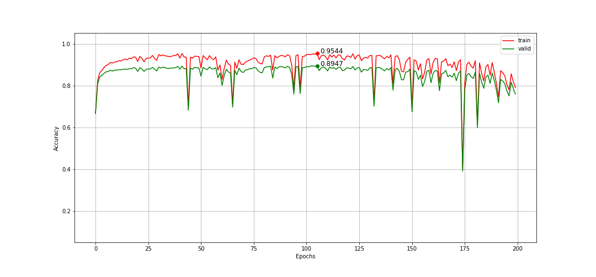

# General digit-classifier
CSE4048 Deep Learning in Hanyang Univ.  

This is a term project to make a general digit-classifier using PyTorch.  

## Dataset
The base dataset contains both 70,000 MNIST images and 50 printed digits images. I applied some tricks to them in order to augment data. Plus, I used 60,000 pattered MNIST images from HY-IN.  
<b>Total 423,700 samples (28x28x3)</b>
- trainset : 413,700 ([download](https://drive.google.com/file/d/1vwuXlnWszUiwddFGfQjGUwUDsdhiJbd2/view?usp=sharing))
- testset : 10,000 ([download](https://drive.google.com/file/d/1wfESebaD4FrtF7g72qMBN0wXvdkwv-xr/view?usp=sharing))



## Running Environment
- Windows 10
- GPU : GeForce RTX 3090/GeForce RTX 2070 mobile
- CUDA 11.2
- Dependencies:
```
python==3.8.2
torch==1.8.1+cu111
torchvision==0.9.1_cu111
opencv-python==4.5.2.52
pandas==1.1.4
```


## Model Structure



The f, p, and s in conv2d layer means a filter size, a padding size, and a value of stride respectively. The p in dropout layer means a probability of an element to be zeroed.  


I designed two digits-classifiers using convolution neural network by referencing to the AlexNet structure. The model has 5 convolutional layers, 2 maxpooling layers, 2 fully-connected layers (except output layer), and 2 dropout layers. Each convolutional layer contains 3x3 filters and 1 stride value. Because the input image size is small as 28x28, I set padding value in each layer, so the size does not decrease greatly during convolution steps. Instead, through maxpooling layers with stride values 2, the machine specifies the features. Channel sizes of convolutional layers and the number of nodes in fully-connected layers are considered hyperparameters.

The best model is MyCNN_5_17_15_12_6.  

- Activation function : ReLU function  
- Initialized weights : He initial value  
- Loss function : Cross-entropy loss function  
- Optimizer : Adam (weight_decay=0.1)  
- Learning rate : 0.001


## Result
  
I randomly split the trainset into trainset(330,960) and validset(82,740). As following the graph, the difference between trainset and validset at the best moment (105th epoch) is about 6%points, and I concluded the model is quite well learned.